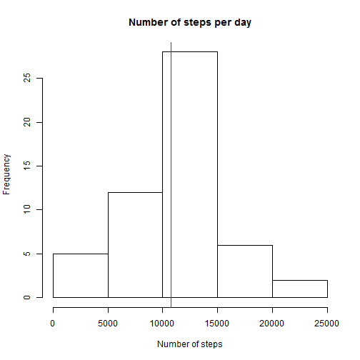
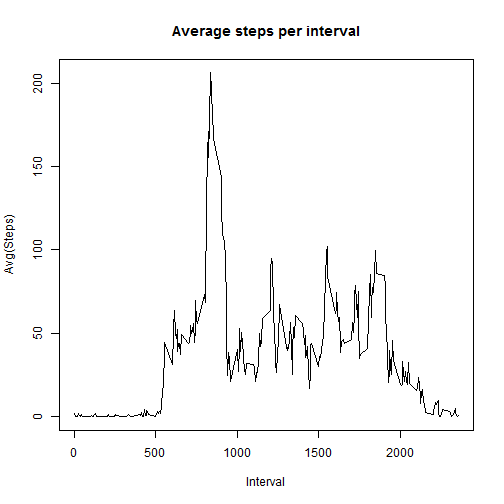
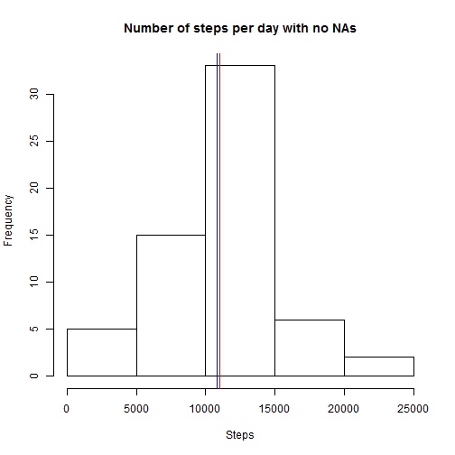
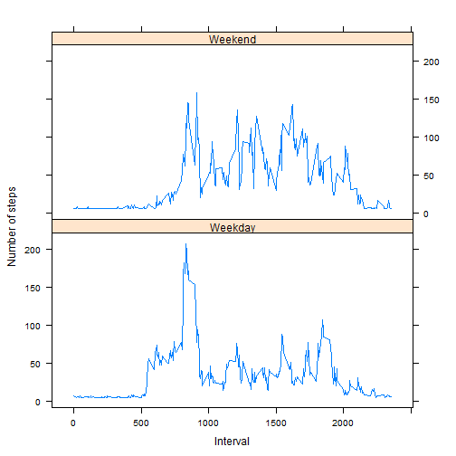

# Reproducible Research: Peer Assessment 1


## Loading and preprocessing the data

We load the data from the activity zip file using the unz() and read.table() function.We assume that the zip file is located in the current working directory. 

Using the read.table() we:

* We separate the data with a comma separator
* We include the headers, but give them new names "Steps","Date","Interval"
* The unknown values are set as NA
* We set stringsAsFactors = FALSE because it will help us with the date string conversion

Finally we convert the 'date' column in Date type using as.Date()

At this first code chunk we set the echo of to be always TRUE (unless overriden).


```r
# read data from zip
activityData <- read.table(unz("activity.zip", "activity.csv"), na.strings="NA", header=TRUE, col.names = c("Steps","Date","Interval"), stringsAsFactors = FALSE, sep=",")


# convert dates
activityData$Date <- as.Date(activityData$Date, format="%Y-%m-%d")
```


## What is mean total number of steps taken per day?

To find the mean we will use the built-in mean function, ignoring the NA values.


```r
# get data without NAs
clearActivityData <- na.omit(activityData)

# compute total steps per day
totalSteps <- tapply(clearActivityData$Steps, clearActivityData$Date, FUN=sum)

# compute mean and median of total steps
meanSteps <- mean(totalSteps)
medianSteps <- median(totalSteps)

# report statistics
meanSteps
```

```
## [1] 10766
```

```r
medianSteps
```

```
## [1] 10765
```

```r
# alternatively show all summary statistics for steps
# summary(totalSteps)
```


```r
# display histogram
hist(totalSteps, main = "Number of steps per day", xlab="Number of steps")
abline(v = meanSteps, col = "blue", lwd = 1)
abline(v = medianSteps, col = "red", lwd = 1)
```

 

The median and the mean are too close to each other to distinguish on the graph.

## What is the average daily activity pattern?

Average the number of steps across all days. This will not include any NA valued intervals/days.


```r
# get average steps
averageSteps <- tapply(clearActivityData$Steps, clearActivityData$Interval, FUN=mean)

# plot time series
with(clearActivityData, {
        plot(unique(Interval),averageSteps, type="l", main="Average steps per interval", xlab="Interval",ylab="Avg(Steps)")        
})
```

 

Then we calculate which 5-min interval on average across all days contains the maximum number of steps (NAs not included).

We can do that either by getting the name of the column with the max average.


```r
names(averageSteps[which.max(averageSteps)])
```

```
## [1] "835"
```

## Imputing missing values

Calculate the total number of missing values. This can be identified either by the summary() of the initial dataset or by the the number of rows after applying is.na or complete.cases.


```r
summary(activityData)
```

```
##      Steps            Date               Interval   
##  Min.   :  0.0   Min.   :2012-10-01   Min.   :   0  
##  1st Qu.:  0.0   1st Qu.:2012-10-16   1st Qu.: 589  
##  Median :  0.0   Median :2012-10-31   Median :1178  
##  Mean   : 37.4   Mean   :2012-10-31   Mean   :1178  
##  3rd Qu.: 12.0   3rd Qu.:2012-11-15   3rd Qu.:1766  
##  Max.   :806.0   Max.   :2012-11-30   Max.   :2355  
##  NA's   :2304
```

```r
length(activityData[!complete.cases(activityData),"Steps"])
```

```
## [1] 2304
```

To fill the empty values we will use the average per weekday. So for example, if there is a missing value for Monday, we will replace that with the average steps the person makes every Monday.


```r
# calculate average per weekday
averageWeekDaySteps <- tapply(clearActivityData$Steps, weekdays(clearActivityData$Date), FUN=mean)

# copy original data
newActivityData <- activityData

# replace NA values
for(r in 1:nrow(activityData)){
        if(is.na(activityData$Steps[r])){
                newActivityData$Steps[r] <- averageWeekDaySteps[weekdays(activityData$Date[r])]
        }
}
```

We then again calculate the mean and median of the new set and display a histogram.


```r
# compute total steps per day
newTotalSteps <- tapply(newActivityData$Steps, newActivityData$Date, FUN=sum)

# compute mean and median of total steps
mean(newTotalSteps)
```

```
## [1] 10821
```

```r
median(newTotalSteps)
```

```
## [1] 11015
```

```r
# display histogram
hist(newTotalSteps, main = "Number of steps per day with no NAs", xlab="Steps")
abline(v = mean(newTotalSteps), col = "blue", lwd = 1)
abline(v = median(newTotalSteps), col = "red", lwd = 1)
```

 

As we can see the mean and median values have shifted and the difference is evident although not great.

## Are there differences in activity patterns between weekdays and weekends?

For this part of the assigment we examine the differences in activity patterns between weekdays and weekends.


```r
# create weekend/weekday factor
daytypeFactor <- factor(c("Weekend","Weekday"), labels = c("Weekend","Weekday"))

# set days in data frame column
newActivityData$Daytype <- as.factor(ifelse(weekdays(newActivityData$Date) %in% c("Saturday","Sunday"),"Weekend","Weekday"))

# get average steps grouping by intervals and day types(weekday/weekend)
newAveragedSteps <- aggregate(Steps~Interval+Daytype, newActivityData, mean)

# create plot of the 5-minute interval (x-axis) and the average number of steps taken, averaged across all weekday days or weekend days (y-axis)
library(lattice)
xyplot( Steps ~ Interval | Daytype, data = newAveragedSteps, type="l", ylab="Number of steps", layout = c(1,2) )
```

 
